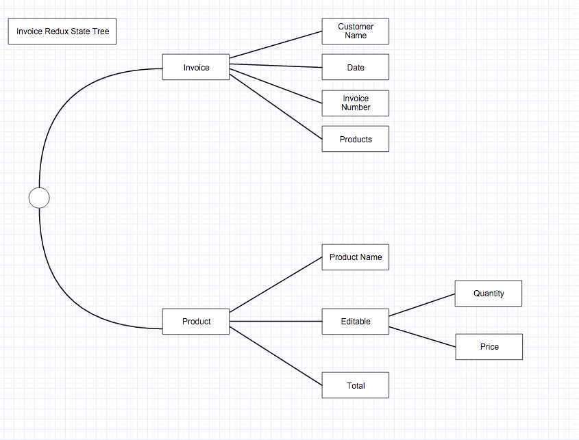
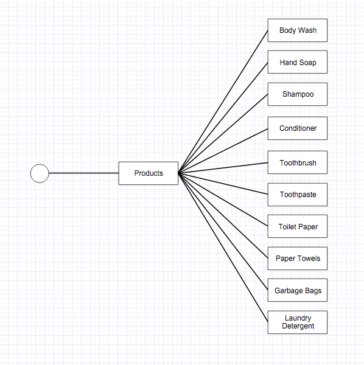
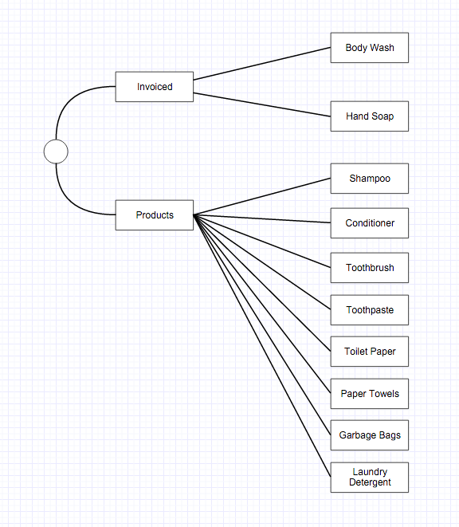

### Invoiced is an invoicing application built using React, Node, Socket.io and Redux ###

### Getting Started ###

```
> git clone https://github.com/invoice-creator/invoiced
> cd invoiced
> cd server
> npm install
> cd client
> npm install

```

### Redux Server Operation Process ###

1. A client sends an action to the server
2. The server hands the action to the Redux Store
3. The Store calls the reducer and the reducer executes the logic related to the action
4. The Store updates its state based on the return value of the reducer
5. The Store executes the listener function subscribed by the server
6. The server emits a 'state' event
7. All connected clients - including the one that initiated the original action - receive the new state


### Redux Client Operation Process ### 

1. The user creates some action via interaction. An action is dispatched
2. The remote action middleware sends the action over the Socket.io connection
3. The client-side Redux store handles the action, causing the local state to be set for that action
4. When the message arrives on the server, the serverside Redux store handles the action, updating the state for that action
5. The listener on the serverside Redux store broadcasts a state snapshot to all connected clients
6. A SET_STATE action is dispatched to the Redux store of every connected client
7. The Redux store of every connected client handles the SET_STATE action with the updated state from the server


### Client Commands ###

To build bundle.js into client/dist:

```
> cd client
> webpack

```

To run webpack dev server with hot reload:

```
> cd client
> webpack-dev-server

```

To run client side tests:

```
> cd client
> npm run test

```

To watch for changes in client side tests:

```
> cd client 
> npm run test:watch

```

### Server Commands ###

To run server:

```
> cd server
> npm run start

```

To run server side tests:

```
> cd server
> npm run test

```

To watch for changes in server side tests:

```
> cd server 
> npm run test:watch

```

### Client Components and Separation of State ###

```
When React components are combined with Redux and Immutable all components become so-called Pure Components (also sometimes called "Dumb Components"). As a concept, this is similar to pure functions, in that there are a couple of rules to follow:

1. A pure component receives all its data as props, like a function receives all its data as arguments. It should have no side effects, including reading data from anywhere else, initiating network requests, etc.

2. A pure component generally has no internal state. What it renders is fully driven by its input props. Rendering the same pure component twice with the same props should result in the same UI. There's no hidden state inside the component that would cause the UI to differ between the two renders.
This has a similar simplifying effect as using pure functions does: We can figure out what a component does by looking at what it receives as inputs and what it renders. There's nothing else we need to know about the component. It can also be tested rather easily.

3. The state lives in an immutable data structure inside of a Redux store. Redux allows us the ability to separate the state from the UI code. React components become a stateless projection of the state at a given point in time.

```

### Client Getting Data In From Redux to React ###

```

The Redux Store that holds our immutable application state. Stateless React components that take immutable data as inputs.

Wrapping our top-level application component inside a react-redux Provider component will connect our component tree to a Redux store, enabling us to make the mappings for individual components later. Placing the <Provider></Provider> element around the <Router></Router> component in index.jsx will  cause the Provider to be an ancestor to all of our application components. For example: 

ReactDOM.render(
  <Provider store={store}>
    <Router>{routes}</Router>
  </Provider>,
  document.getElementById('app')
);

Using react-redux we take the pure components and wire them up into a Redux Store by doing three things:

1. Mapping the Store state into component input props
2. Mapping actions into component output callback props

Next, determine which of the components need to be "wired up" so that all the data will come from the Store. For this application the components that are used in routes will need their data. The App.jsx component does not use any data so it will not need anything.

With react-redux the connect function handles the wiring up of a component. It takes a mapping function as an argument and returns another function that takes a React component class.

The role of the mapping function is to map the state from the Redux Store into an object of props. Those props will then be merged into the props of the component that is being connected.

True to functional style, the connect function doesn't actually go and mutate these components. The components it touches remains pure and unconnected. Instead, connect returns a connected version of each component.

Each component module exports TWO different components: The pure component (not hooked up via the connect function) and the connected component (hooked up using the connect function). We call the former a "pure" or "dumb" component and the latter a "connected" or "smart" component. Here are the differences:

1. The pure/dumb component is fully driven by the props it is given. It is the component equivalent of a pure function
2. The connected/smart component, on the other hand, wraps the pure version with some logic that will keep it in sync with the changing state of the Redux Store. That logic is provided by react-redux.

In order to differentiate between the two components we use a container reference to the connected/smart component and pass that to our routing. For example in src/components/Invoice.jsx: 

export const Invoice = React.createClass({
  ...does something
});

export const InvoiceContainer = connect(mapStateToProps)(Invoice);

Then in src/index.jsx:

import {InvoiceContainer} from './components/Invoice';

const routes = <Route component={App}>
  <Route path="/results" component={ProductSearch} />
  <Route path="/" component={InvoiceContainer} />
</Route>;

Note that in test/Invoice_spec.jsx we will need to change the way the import is done as Invoice is no longer the default export option from src/components/Invoice.jsx:

import {Invoice} from '../../src/components/Invoice'; 

```

### Setting Up The Socket.io Client ###

```
The server is prepared to take incoming socket connections and emit the voting state to them. The client, on the other hand, has a Redux store into which we could easily dispatch incoming data. To draw the connection we use socket.io-client, which gives us io function that can be used to connect to a Socket.io server. In client/src/index.jsx:

import io from 'socket.io-client';

const socket = io(`${location.protocol}//${location.hostname}:8090`);

Note that during development there will actually be two Socket.io connections on the page. One is ours and the other is supporting Webpack's hot reloading.

```

### Receiving Actions From the Server ###

```
The server sends our client state events - once when we connect and then every time something changes. The client listens to those events. When one occurs, we can simply dispatch a SET_STATE action to our Store. In client/src/index.jsx:

socket.on('state', state =>
  store.dispatch({type: 'SET_STATE', state})
);

```

### Dispatching Actions Out from the Client ###

```
In client/src/reducer.js we can use methods like state.set and state.remove to send actions and manipulate the state tree.

In addition to wiring up input props, react-redux can be used to wire up output actions. For these output actions we use Action creators.

Action creators are pure functions that just return action objects. They encapsulate the internal structure of the action objects so that the rest of the codebase doesn't need to be concerned with that. Actions creators also conveniently document all the actions that can be dispatched in a given application. That information would be more difficult to gather if it was sprinkled all over the codebase in object literals.

In client/src/action_creators.js we export:

export function setState(state) {
  return {
    type: 'SET_STATE',
    state
  };
}

Then, in client/src/index.jsx we import the setState function from the action_creators file. 

import {setState} from './action_creators';

const socket = io(`${location.protocol}//${location.hostname}:8090`);
socket.on('state', state =>
  store.dispatch(setState(state))
);

 Finally, give our action creators to the react-redux connect function as the second argument to each component that uses the connect function, and the connection will be made. In client/src/components/Invoice.jsx:

 import * as actionCreators from '../action_creators';

 export const InvoiceContainer = connect(
  mapStateToProps,
  actionCreators
)(Invoice);

```

### Sending Actions To The Server Using Redux Middleware ###

```
The client-side actions need to get sent to the server, so that the actions are dispatched to both of the Redux stores. There's nothing built into Redux for this purpose, since supporting a distributed system like this application isn't really part of its core functionality. It is left to us to decide where and how we send client-side actions to the server.

What Redux does provide is a generic way to tap into actions that are being dispatched to Redux stores: Middleware. A Redux middleware is a function that gets invoked when an action is dispatched, before the action hits the reducer and the store itself. Middleware can be used for all kinds of things, from logging and exception handling to modifying actions, caching results, or even changing how or when the action will reach the store. What this application uses them for is sending client-side actions to the server.

Note the difference between Redux middleware and Redux listeners: Middleware are called before an action hits the store, and they may affect what happens to the action. Listeners are called after an action has been dispatched, and they can't really do anything about it.

We create a "remote action middleware" that causes an action to be dispatched not only to the original store, but also to a remote store using a Socket.io connection. In client/src/remote_action_middleware.js:

export default store => next => action => {

}

The code above may look a bit foreign but it's really just a more concise way of expressing this:

export default function(store) {
  return function(next) {
    return function(action) {

    }
  }
}

This style of nesting single-argument functions is called currying. In this case it's used so that the Middleware is easily configurable: If we had all the arguments in just one function (function(store, next, action) { }) we'd also have to supply all the arguments every time the middleware is used. With the curried version we can call the outermost function once, and get a return value that "remembers" which store to use. The same goes for the next argument.

The next argument is a callback that the middleware should call when it has done its work and the action should be sent to the store (or the next middleware). In our case the middleware should send a given action to a Socket.io connection, in addition to giving it to the next middleware. The socket.emit function emits an action event from the middleware. We can extend the middleware to only send certain actions to the server. Concretely, we should only send out actions that have a {meta: {remote: true}} property attached. In client/src/remote_action_middleware.js:

export default socket => store => next => action => {
  if (action.meta && action.meta.remote) {
    socket.emit('action', action);
  }
  return next(action);
}

Note: the middleware could also decide not to call next, if it decided that the action should be halted. In that case it would never go into the reducer or the store.

We will then want to update each action creator we actually want to send to the server. For example, the action creator for INVOICED should now set this property, where as the one for SET_STATE should not in client/src/action_creators.js:

export function setState(state) {
  return {
    type: 'SET_STATE',
    state
  };
}

export function invoiced(product) {
  return {
    meta: {remote: true},
    type: 'INVOICED',
    product
  };
}

Next the middleware gets plugged into our Redux store, all actions should get logged. The middleware can be activated using an applyMiddleware function that Redux ships with. It takes the middleware we want to register, and returns a function that takes the createStore function. That second function will then create a store for us that has the middleware included in it. In client/src/components/index.jsx:

import remoteActionMiddleware from './remote_action_middleware';

const socket = io(`${location.protocol}//${location.hostname}:8090`);
socket.on('state', state =>
  store.dispatch(setState(state))
);

const createStoreWithMiddleware = applyMiddleware(
  remoteActionMiddleware(socket)
)(createStore);
const store = createStoreWithMiddleware(reducer);

Note: the socket connection above needs to be created before the middleware gets used as it relies on having a socket connection.

```

### Application Immutable State Tree: ###



### Immutable State Tree for product line items: ###



### When product line items are added to an invoice the state should reflect the changes and the items should no longer be listed in the products section, but instead on the actual invoice: ###




